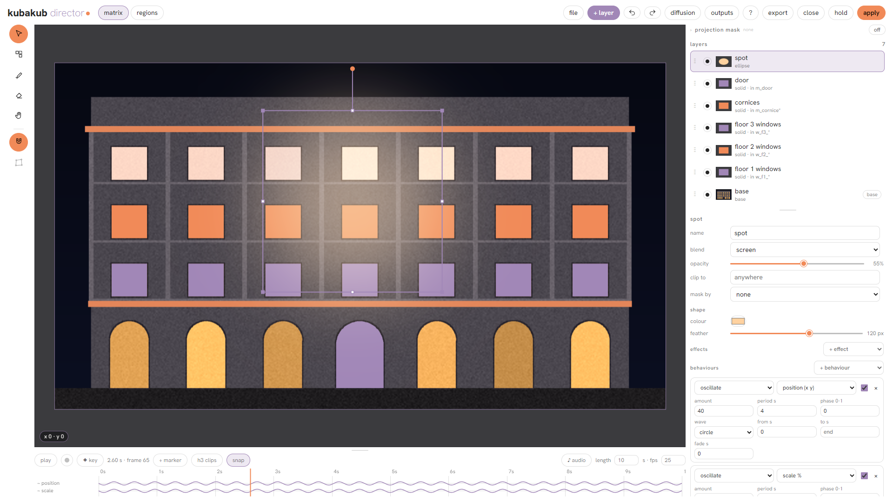
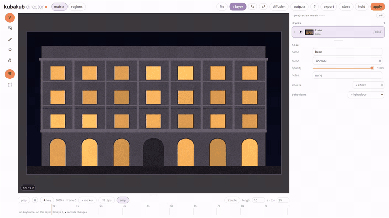
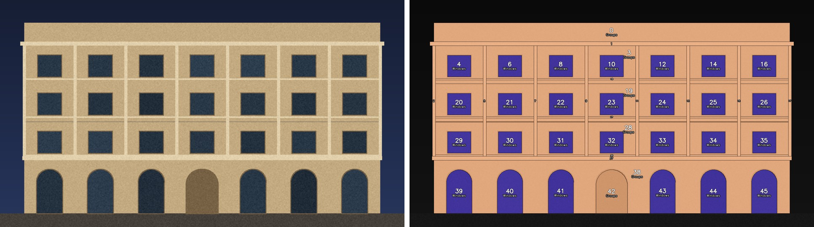

# kubakub nodes

**Projection mapping inside ComfyUI.** Tools to turn a building facade into a show: split it into its parts,
give every part its own prompt, compose and animate layers on it in a timeline window, and export the result
for the projector.



Layers clipped to the windows of the sample facade, moved by behaviours on the timeline (starter 03 with the
regions of starter 01 connected):



## What the nodes do

- **kubakub director**: a compositing window inside ComfyUI, made for facades. Layers (images, video, colour,
  shapes, paint, light) that you move, mask and clip to parts of the building ("only the floor 1 windows"), a
  timeline with keyframes, behaviours (orbit, breathe, spin ...), markers and sound, and export as stills, video or
  ProRes. Any layer can be re-diffused from inside the window.
- **Regions**: the facade split into every window, door, cornice and floor, each with a name. From a colour
  matrix, a folder of After Effects masks, an Illustrator file, a hand sketch, SAM 3, or straight from 3D.
- **From a 3D file to regions**: *scene render* reads a `.fbx` / `.blend` / `.glb` with Blender and renders the
  projector's view as clay, depth and ID passes; every stone, window and column of the model becomes a region by
  itself. A cryptomatte or ID render from Houdini or any renderer works too.
- **A prompt per region**: a short rule text gives each region (or group, or floor) its own prompt and settings;
  the *region sampler* diffuses them one by one with Flux 2 Klein or Qwen Image, and the facade around them stays
  pixel exact. *versions* makes a numbered sheet of looks from one queue.
- **Motion**: LTX 2.5 and MiniMax H3 animate chosen regions while the building stays still, as loops and with
  sound; 3D pieces of the model can be pushed, tilted and turned by waves and beats.
- **Finishing**: colour match, deflicker, retime, burn in, delivery export; even brightness on the real building.



## Install

With **ComfyUI Manager**: search for *kubakub nodes*, install, restart. The pack is in the Comfy Registry as
`comfyui-kubanodes` (publisher `kubakub`), so `comfy node install comfyui-kubanodes` works too. Or by hand:

```bash
cd ComfyUI/custom_nodes
git clone https://github.com/kubakubkub/ComfyUI_KubaNodes
python -m pip install -r ComfyUI_KubaNodes/requirements.txt     # the portable build: python_embeded\python.exe -m pip ...
```

The only package this adds is OpenCV, and only if you don't have it yet. Everything else comes with ComfyUI
(0.37.0 or newer). For the 3D nodes and light layers, install [Blender 4.x](https://www.blender.org/download/lts/4-5/)
(found by itself).

**Models:** the example workflows need them, the nodes don't: see [docs/MODELS.md](docs/MODELS.md). Any variant of a
model works (bf16, fp8, int8, NVFP4, GGUF ...): pick your file in the loader when a workflow names another one.

## Quick start

1. Install, restart ComfyUI.
2. **Workflow → Browse templates → ComfyUI_KubaNodes → 01 regions in 30 seconds**, Queue. No models, no files:
   the **kubakub sample facade** node draws a facade to try everything on.
3. **03** opens the director window on that facade: add a layer, clip it to a floor, give it a behaviour, press
   play. Still no models.
4. Then **02** (a prompt per region, Klein 4B), **04** (LTX animates the windows), **05** (a hand sketch rendered
   region by region), **06** (finishing a clip: colour match, deflicker, retime, burn in).
5. With your own 3D: **clay_to_final** (scene file → clay → regions → Klein → seam pass → even light),
   **scene3d_to_regions** and **regions_from_cryptomatte** (a cryptomatte EXR from any renderer). **versions**
   makes many versions of the facade from one queue: a numbered contact sheet of drafts, then your picks at full size.

## What each part needs

Most of the pack runs on a plain ComfyUI. Add the rest when you get there:

- **Nothing extra:** regions, the region plan, sketch, post and the director with still layers. Workflows 01 and 03.
- **Image models** (Klein 4B is the smallest, see [docs/MODELS.md](docs/MODELS.md)): region sampler, seam pass,
  versions, frame in frame, sketch to render. Workflows 02 and 05.
- **Video models** (LTX 2.5, MiniMax H3; tested on a 12 GB GPU): region video sampler, keyframe clips. Workflow 04.
- **Blender 4.x and a 3D file with a camera:** everything under 3d, and light layers in the director.
  Workflow clay_to_final.
- **Your own files**, for the nodes that read them: an Illustrator file, ID renders or a cryptomatte EXR, a video
  clip for 06.

The example workflows start from the **kubakub sample facade** node, so they run without any file of yours unless
their note says otherwise. Packages, Blender and ffmpeg are listed under [Requirements](#requirements).

## Node groups

The menu is split into **2d** (images, masks, video) and **3d** (anything that needs a 3D file or render passes).

| group | nodes |
|---|---|
| **project** | project settings (matrix size, fps, name, audience: link them into the other nodes), sample facade |
| **2d / regions** | regions from matrix / masks (colours, line drawing, After Effects mask folders), regions from masks, regions from sam3, regions from illustrator (.ai / .pdf layers), regions to mask, regions to svg / pdf / dxf; canvas plan / to work / restore |
| **2d / sketch** | scan to line (a phone photo of a drawing, straightened and cleaned), regions from sketch (closed shapes, coloured dots as names), line overlay (your line back on the render) |
| **2d / generate** | region plan (rules: a prompt and settings per region), region sampler (Klein, Qwen Image 2.1), seam pass, versions (a sheet of looks, ideas per region, prompt rotation, LoRAs and style images: fast numbered drafts, then the picks at full size), audience viewpoint, frame in frame (rooms and worlds behind windows) |
| **2d / director** | kubakub director (the window), director sequence (every frame, sound), director diffuse |
| **2d / motion** | region video sampler (ltx), keyframe clips (h3, video with sound), trim to exact duration (audio clips of a constant length for LTX AV) |
| **2d / post** | colour match (to a reference, as .cube too), apply lut, deflicker, retime (optical flow), burn in, export video / frames |
| **3d / scene** | scene render (Blender: clay, depth, ID passes), scene relight (Cycles), scene measure, scene preview and walkthrough (previz from the audience), brightness compensation |
| **3d / pieces** | scene pieces, pieces falloff, pieces beat falloff, pieces transform, pieces render: the model's parts (or whole regions) moved like MOPS in Houdini (a wave, a pulse, a stagger, noise or the beats of the director's timeline push, tilt, turn and scale stones, windows and cornices), rendered in Cycles as clay or with the matrix projected on them, from the projector or from the audience |
| **3d / from renders** | regions from cryptomatte (every object by its name from the 3D scene), regions from id renders (Houdini, Blender, any ID pass) |
| **3d / fabricate** | relief panels in millimetres (mould prep, safety check, STL / OBJ), mesh to relief field, save GLB |
| **lab** | experiments: mosaic illusion, onnx style transfer, frame guide (old) |
| **utils** | load images from a folder, timecode filename prefix (clip start in seconds -> `name_mm-ss-ff`) |

### Show only what you use

Copy `kubakub.ini.example` to `kubakub.ini` (same folder) and switch groups off, then restart ComfyUI:

```ini
[menu]
3d = off            # everything under kubakub/3d
lab = off
2d/motion = off     # no LTX / H3
```

Switched-off nodes are not loaded at all, so workflows that use them show them as missing until you switch them on
again. The console says what is hidden: `[Kub] kubakub.ini: 3d, lab off (21 nodes hidden)`.

Search the node menu for `kubakub`, or for words like *projection mapping*, *facade*, *sam*, *ltx*, *h3*, *blender*.

## Speed and caches

Unchanged work is never done twice, also across queues and (for the 3D scene) across ComfyUI restarts. The sizes
are settings in `kubakub.ini` (section `[settings]`, see `kubakub.ini.example`); the defaults suit a 12 GB GPU:

| what | cache | setting |
|---|---|---|
| region sampler | every region's result (keyed on its pixels, prompt, seed, settings, model) and every prompt encoding: one changed prompt re-samples one region | `region_cache_mb = 4096`, `cond_cache_mb = 2048` (0 = off) |
| director sequence | the frames: moving the playhead or changing window-only settings reuses them; an identical export is not written twice | `director_seq_cache = 2` (results, 0 = off) |
| ltx region video / h3 clips | every clip; H3's enhanced prompt separately (steps or LoRA changes do not re-run the enhancer); models load once for all clips, and not at all while the director holds or nothing is animated | - |
| scene render / relight / walkthrough | ID passes, every relit frame, every walkthrough view, on disk in the user folder (`kubakub_cache`), least recently used first above the cap | `cache_folder =` (empty = user/kubakub_cache), `cache_gb = 20` |
| Blender | one worker process stays loaded between jobs | `blender_idle = 600` (seconds), `blender_worker = off` to start it for every job |

## Requirements

**Tested with:** ComfyUI 0.37.0, torch 2.10 cu130, Python 3.12, Blender 4.5, Windows 11, RTX 5070 Ti 12 GB.
Other systems are untested.

| needs | for | without it |
|---|---|---|
| ComfyUI **0.37.0** or newer | every node (V3 node API, advanced inputs; core SAM3, background removal, H3 guide) | modules fail to load (each one alone; the console says which) |
| torch, numpy, scipy, Pillow | everything | come with ComfyUI; no torch / CUDA version of its own |
| **OpenCV** (`opencv-python-headless`, in requirements.txt) | almost everything | the pack does not load; keep an OpenCV build you already have |
| shapely | regions to vector: outlines | that feature only |
| scikit-image | regions to vector: centerlines | that feature only |
| PyMuPDF | regions from illustrator, vector PDF | that feature only |
| imageio | EXR ID maps in regions from id maps | PNG ID maps still work |
| trimesh | mesh to field | that node only |
| onnxruntime | onnx style transfer | that node only |
| **Blender 4.x** (found in Program Files or on PATH; else `blender = ...` in kubakub.ini or the blender_path input) | scene render, light layers, relight | the 3D scene nodes and light layers |
| **ffmpeg** (imageio-ffmpeg or on PATH) | video layers, director sequence export, kubakub export | video in the director and exports |

At startup the console prints `[Kub] N nodes from M modules` and, only when something is missing, one line per
problem (`kub_env.py`), e.g. `[Kub] not installed (only these features are off): regions to vector (outlines) -> pip
install shapely`. The models used by the example workflows (Klein, Qwen Image 2.1, LTX 2.5, MiniMax H3) are listed in
each workflow's read-me note; the nodes themselves need none.

## Documentation

One page per menu group, with every input, the rule syntax, speeds and tests:

| page | what is in it |
|---|---|
| [regions](docs/regions.md) | regions from a matrix, a line drawing, mask folders, any masks, SAM 3, Illustrator; regions to SVG / PDF / DXF; canvas plan / to work / restore |
| [sketch](docs/sketch.md) | scan to line, regions from sketch, line overlay |
| [generate](docs/generate.md) | region plan (the rule text), region sampler (Klein, Qwen Image 2.1 and its LoRAs), seam pass, audience viewpoint, frame in frame |
| [director](docs/director.md) | the director window: layers, timeline, sound, LTX and H3 clips, diffuse, light layers, video mapping, behaviours, export |
| [post](docs/post.md) | colour match, apply lut, deflicker, retime, burn in |
| [3d scene](docs/scene3d.md) | scene render and its ID passes, architecture passes, scene measure, preview, walkthrough, brightness compensation, moving pieces |
| [from renders](docs/from-renders.md) | regions from ID renders (Houdini, Blender, any ID pass), regions from cryptomatte |
| [fabricate](docs/fabricate.md) | relief panels in millimetres, safety check, STL / OBJ |
| [models](docs/MODELS.md) | the models the example workflows use, and where they go |

Every group has a model-free test in `tests/`, e.g. `python_embeded\python.exe ComfyUI\custom_nodes\ComfyUI_KubaNodes\tests\test_plan.py`.

## Credits

- Crop sampling with the crop latent as reference, and the two-band blend idea:
  GianlucaMancuso/ComfyUI-TiledUpscale (github.com/GianlucaMancuso/ComfyUI-TiledUpscale).
- Clamped mean/std colour match, consistent noise idea: Gavr728/ComfyUI_KleinTiledUpscaler.
- Differential diffusion step (`kubakub/seams.py`): adapted from ComfyUI core
  comfy_extras/nodes_differential_diffusion.py, originally github.com/exx8/differential-diffusion.
- Pruna 8-step sigmas (`kubakub/schedules.py`): model card of
  huggingface.co/PrunaAI/Pruna-Qwen-Image-2.1 (PrunaAI).
- Flux 2 schedule (`kubakub/adapters.py`): copied from ComfyUI core
  comfy_extras/nodes_flux.py (github.com/comfyanonymous/ComfyUI, Comfy Org).
- Video layers (`kubakub/director/media.py`): stream parsing, the two-step seek, the raw frame pipe and the
  audio read adapted from ComfyUI-VideoHelperSuite (github.com/Kosinkadink/ComfyUI-VideoHelperSuite,
  Kosinkadink / AustinMroz).
- A sound as a held audio latent in the region video sampler (`nodes/motion/nodes_video.py`): the wiring of
  RuneXX's custom-audio LTX workflows (huggingface.co/RuneXX/LTX-2.3-Workflows).
- MKL colour transfer: Pitie & Kokaram 2007, as in the color-matcher library
  (github.com/hahnec/color-matcher); reimplemented in torch in `kubakub/ops.py`.

## License

GPL-3.0 (see `LICENSE`), the same as ComfyUI. Free to use, change and share, also in paid work; a changed version
that is published must stay GPL-3.0 with its source. The license covers this code only: images and videos you make
with the nodes are yours. The Hanken Grotesk font in `web/fonts` keeps its own SIL Open Font License.
